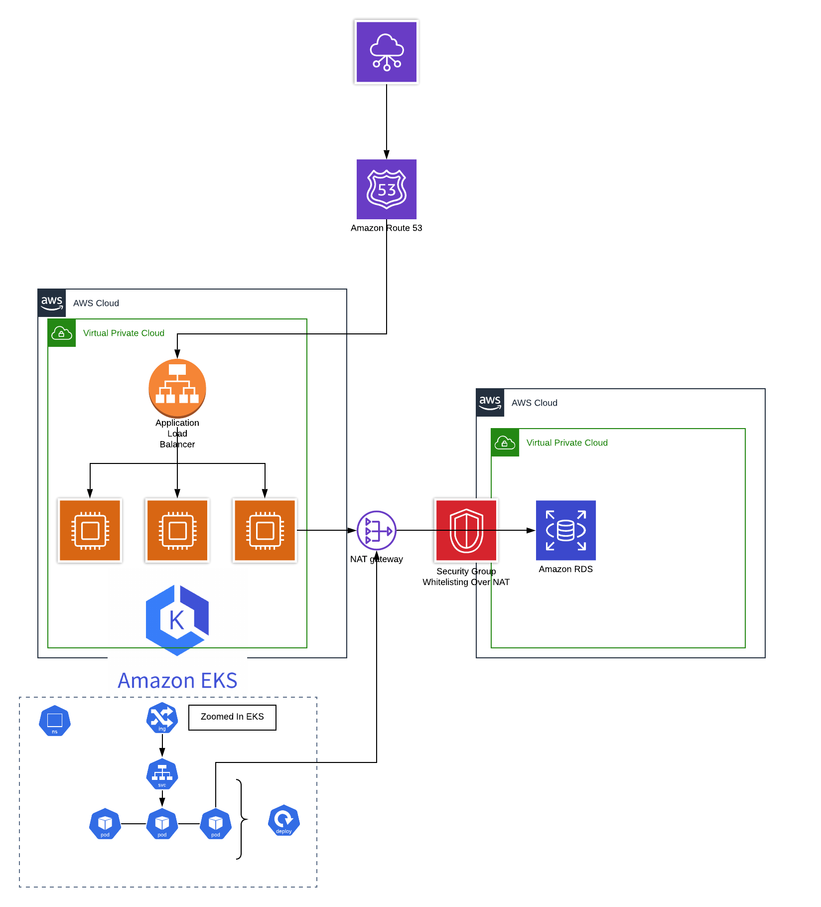

Golang-Http-test
============

Testing Golang's Http capabilities without HTTP Packages

Only uses packages for sqlite3 stateful db for local dev.

Dependencies
------------
* Glog - Google's logging used by Kubernetes
* Go-sqlite3 - Local DB for lightweight sql

Usage Local Docker Setup
--------
```
git clone git@github.com:kenichi-shibata/golang-http-test
cd golang-http-test
mkdir db
docker run -it -v $(pwd)/db:/app/db/ -p 8080:8080 quay.io/kenichi_shibata/golang-http-test:8e8dbdd
```
If you are running on mac you might need to enable mounts on docker. https://docs.docker.com/docker-for-mac/osxfs/#namespaces

Once you have the application running you can run a series of request for checking.

```
sh hack/test.curl
```

The DB Created via sqlite3 will be stored on your `$(pwd)/db/users.db`

Development
------------
Once you have local docker environment setup. Development can be done locally
as well via Makefiles

```
make run
make test
```

### Tidying up dependencies

```
go mod tidy
```

### Build Docker image
```

make build
```
### Run Docker image
```
docker run -it -v $(pwd)/db:/app/db -p 8080:8080 quay.io/kenichi_shibata/golang-http-test:<GIT_HASH>
```
### Registry
```
docker push quay.io/kenichi_shibata/golang-http-test:<GIT_HASH>
```

Prerequisites
------------
* go version 1.12+
* make
* docker
* kubectl
* helm

Changing DB
--------------------
Currently this application only supports sqlite3 and postgres.

By default the application uses sqlite3 file created as `users.db` on the local mounts. If you want to use a remote SQL DB like RDS. Please specify this in the environment variables like

```
docker run --env-file changeme.env -p 8080:8080 -it quay.io/kenichi_shibata/golang-http-test:8e8dbdd
```

Where your env file will have for postgres
```
DB_TYPE=postgres
POSTGRES_ENV_POSTGRES_USER=postgres
POSTGRES_ENV_POSTGRES_PASSWORD=foo
POSTGRES_ENV_DB_NAME=users
POSTGRES_ENV_TCP_ADDR=database-1.xxxx.eu-west-1.rds.amazonaws.com
POSTGRES_ENV_PORT=5432
POSTGRES_ENV_SSL_MODE=require
POSTGRES_ENV_ROOT_CERT=/path/to/rootcert
```
Make sure your database connection encryption is using a known certificate authority otherwise the connection will fail. Or you can set the rootcert from the machine to trust the db via `POSTGRES_ENV_ROOT_CERT=/path/to/rootcert`.  Or you can set `POSTGRES_ENV_SSL_MODE=disable` but this is highly discouraged.

`DB_NAME` should already exists using `default` as `DB_NAME` will work but discouragrd for production use.

AWS RDS Postgres
-------
Once you have aws rds postgres provisioned and users db created.

Download the RDS root cert
```
mkdir $(pwd)/certs
wget -O $(pwd)/certs/rds-certs.crt https://s3.amazonaws.com/rds-downloads/rds-combined-ca-bundle.pem

export POSTGRES_ENV_SSL_MODE=require
export POSTGRES_ENV_ROOT_CERT=$(pwd)/certs/rds-certs.pem
// or update the env file
```

Further documentation in AWS Docs https://docs.aws.amazon.com/AmazonRDS/latest/UserGuide/UsingWithRDS.SSL.html.


DB Creation
---------

The DBs need to created with the following SQL Statement for SQLite
```
CREATE TABLE IF NOT EXISTS users (id INTEGER PRIMARY KEY, name TEXT, birthdate TEXT)
```
and Postgres
```
CREATE TABLE IF NOT EXISTS users (id SERIAL PRIMARY KEY, name TEXT, birthdate TEXT)
```
You can use a AWS RDS Postgres for deployment of database. Or if your kubernetes cluster supports statefulsets you can setup a postgres database quite easily using helm.

Deployment and Rolling Updates using Kubernetes
---------------------
Assuming you have a running kubernetes cluster.

The recommendation is to separate the stateful DB from the Application. As such having the App on a Kubernetes cluster and the DB on RDS or other stateful provider makes sense. This is to loosely couple the application from the DB. However we have to keep in mind any schema changes and makes sure that any newer updates are backwards compatible and easily understand by well known frameworks such as semver.

For Kubernetes Deployments you will need to have a separate DB from the applications. And you need to specify those in `configmap.yaml` in the manifests/.

Here is an example of how you would do a Rolling Update for the application with zero downtime.

You must also change the configuration of the DB via `configmap.yaml` and store the password in `secret.yaml`. They are mounted as environment variables when deploying the containers.

```
cp -R example-manifest/ manifest/
# update the secret.yaml and configmap.yaml
# the rds certificate is already attached to the configmap-rds
```

```
kubectl create namespace -n test-namespace
kubectl apply -f manifests/ -n test-namespace
```

Doing a rolling update is as simple as changing the image on the `deployment.yaml` manifest

```
      containers:
      - image: "quay.io/kenichi_shibata/golang-http-test:<new>"
```

Do another apply by default deployments uses rollingUpdate strategy to prevent downtime.

```
kubectl apply -f manifests/ -n test-namespace
```
If you are running rds and kubernetes make sure you have the Kubernetes NAT Gateways or wherever your cluster ips are coming from, whitelisted in the RDS security group otherwise you will get timeouts like.

```
[golang-http-test-64c45c947b-bc67v] E0808 14:08:29.062823       1 sql.go:61] dial tcp x.x.x.x:5432: connect: connection timed out
```
### Proxying to local once deployed

```
kubectl port-forward deployment/golang-http-test 8080 -n test-namespace
```

Try to run the sample curl commands again
```
sh hack/test.curl
```

Cleaning up
```
kubectl delete namespace test-namespace
```

### Setting up with Loadbalancer and DNS

Assuming everything went well before this and you would like to deploy this to as working Kubernetes Cluster using Load Balancer.

Change `service.yaml`
```
  type: ClusterIP
	# =>
	type: LoadBalancer
```

Create a record in your Route53 DNS server with the CNAME of the created loadbalancer.

For example:
```
abcd.example.com CNAME abcd-elb-eu-west-1.amazonaws.com
```

You application will now be reachable on `abcd.example.com`

Setting up on AWS EKS
------------------
The easiest way to set this up is use a [cattle cluster](https://thenewstack.io/how-to-treat-your-kubernetes-clusters-like-cattle-not-pets/)
via [eks-cluster repo](https://github.com/kenichi-shibata/eks-cluster)

Helm Chart Deployment
------------

Architecture on AWS Deployment using EKS
======================
Using two AWS Accounts one used for Stateful Sets and DBs. And Another AWS Account for Stateless workloads



TODO
-----
* [x] Fix the insert to update instead (currently PUT creates a new record and on GET you only get the first record and ignoring the records created after that)
* [x] Fix insert to be idempotent
* [x] Make the DB configurable to use an external SQL db like RDS
* [ ] Create terraform script for vpc, subnet creation, igw, rds
* [x] Make the DB configurable to be a mounted volume
* [x] Create a Kubernetes Manifest
* [ ] Create a helm chart
* [ ] Make log level configurable and the environment variables passed on via command line arguments
